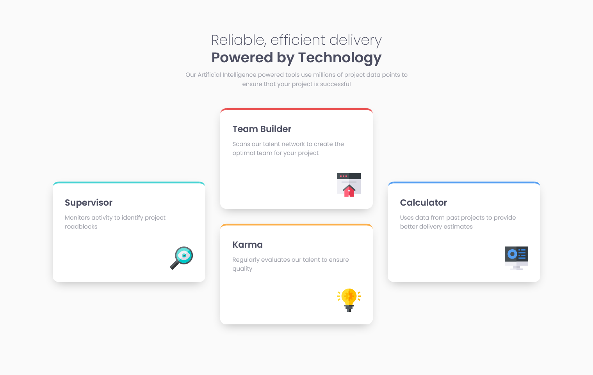
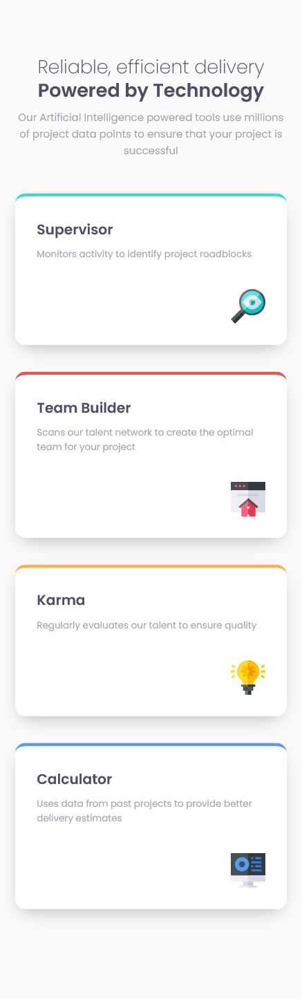

# Frontend Mentor - Four card feature section solution

This is a solution to the [Four card feature section challenge on Frontend Mentor](https://www.frontendmentor.io/challenges/four-card-feature-section-weK1eFYK). Frontend Mentor challenges help you improve your coding skills by building realistic projects. 

## Table of contents

- [The challenge](#the-challenge)
- [Screenshot](#screenshot)
- [Links](#links)
- [Built with](#built-with)
- [Useful resources](#useful-resources)
- [Author](#author)

### The challenge

Users should be able to:

- View the optimal layout for the site depending on their device's screen size

### Screenshot

### Links

- Solution URL: [https://www.frontendmentor.io/solutions/4-card-feature-section-with-html5css3flexbox-and-grid-B8sZ1kCBu](https://www.frontendmentor.io/solutions/4-card-feature-section-with-html5css3flexbox-and-grid-B8sZ1kCBu)
- Live Site URL: [https://ganbnuray.github.io/four-card-feature-section-master/](https://ganbnuray.github.io/four-card-feature-section-master/)

### Built with

- Semantic HTML5 markup
- CSS custom properties
- Flexbox
- CSS Grid

### Useful resources

- [Box Shadow Generator](https://cssgenerator.org/box-shadow-css-generator.html) - This tool helped me create box shadows for the cards.

## Author

- Frontend Mentor - [@ganbnuray](https://www.frontendmentor.io/profile/ganbnuray)

